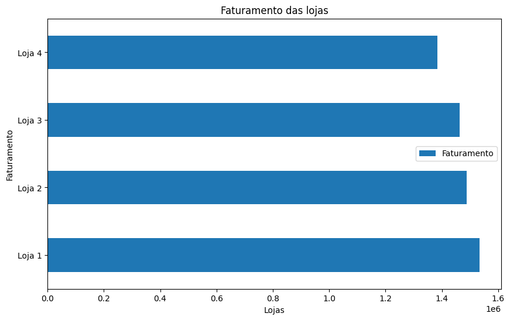
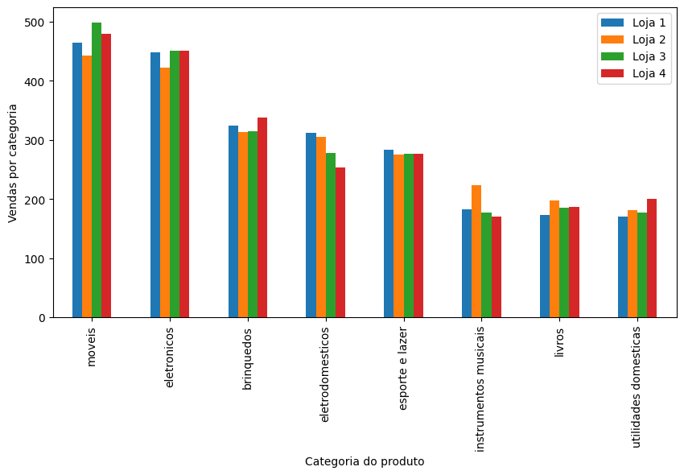
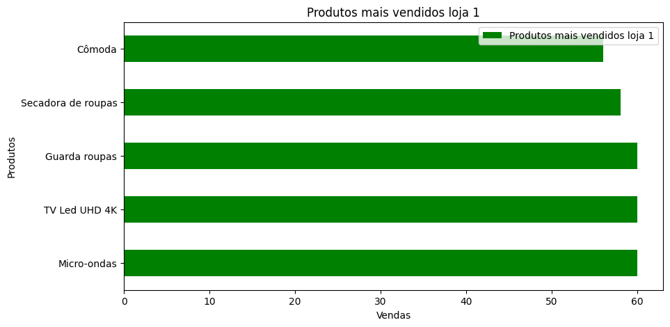
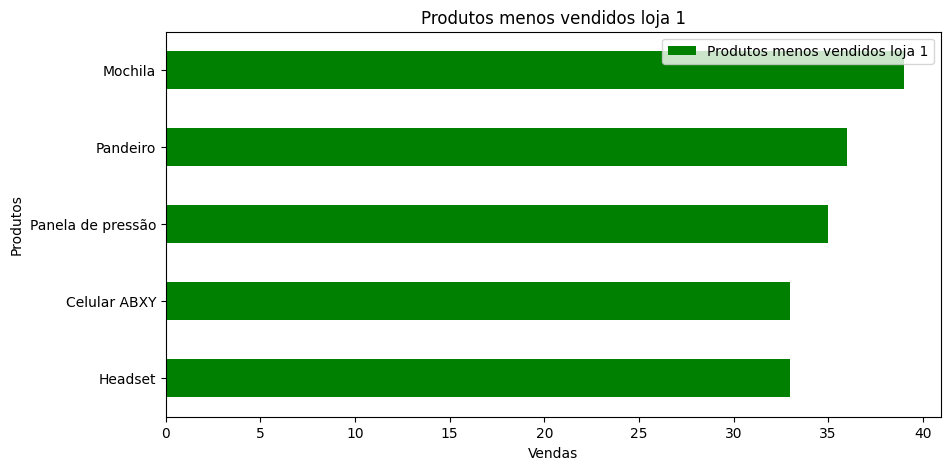
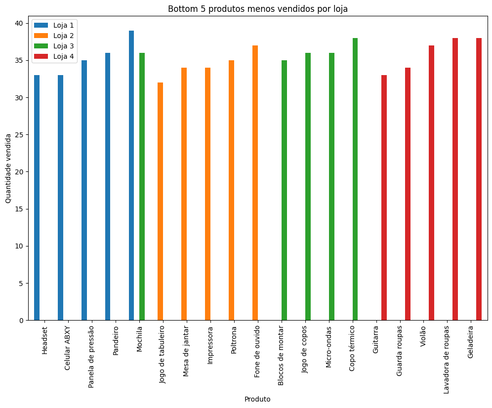

# Alura_Store

 
## Descrição
Neste projeto irei ajudar o Senhor João a decidir qual loja da sua rede vender, analisando dados de vendas, desempenho e avaliações de suas 4 lojas. 

O objetivo é identificar a loja com menor eficiência e apresentar uma recomendação final baseada nos dados.


## Conhecendo os dados
Iniciei o projeto realizando checagens exploratórias para compreender e visualizar o conjunto de dados.   

Nessa etapa, obtive informações como:
* estrutura da base de dados
* número de linhas e colunas
* nomes das variáveis
* tipos de dados
* valores presentes 

Além disso, verifiquei a existência de valores nulos e registros duplicados, garantindo uma compreensão inicial da qualidade dos dados.


## Métodos utilizados na exploração dos dados:
### Visualizando as primeiras linhas do DataFrame:
```python
loja2.head()
```
### Obtendo informações gerais:
```python
loja2.info()
```
### Obtendo número de linhas e colunas:
```python
loja2.shape
```
### Calculando estatísticas descritivas:
```python
loja2.describe()
```
### Identificando valores nulos:
```python
loja2.isnull().sum()
```
### Identificando valores duplicados:
```python
loja2.duplicated().sum()
```
  
## Analisando os dados
Em seguida comecei a análise mais detalhada dos nossos conjuntos de dados.

Nessa etapa, calculei:
* O faturamento total de cada loja, com o objetivo de comparar qual apresenta o maior faturamento.
* A quantidade de produtos vendidos por categoria em cada loja e para melhor visualização criei um gráfico de barras agrupadas comparando as categorias de produtos mais vendidas.
* A média de avaliações de clientes por loja e para a visualização utilizei um gráfico de pontos.
* Identificação dos produtos mais e menos vendidos em cada loja, com gráficos de barras individuais por loja e gráficos de barras agrupadas para comparação entre as quatro lojas. 
* O custo médio de frete para cada loja, representados por um gráfico de colunas.

## Codigos e metodos utilizados para as analises e visualizações
### Calculando faturamento total por loja:
```python
faturamento_loja = loja['Preço'].sum()
print(f'Faturamento loja R${faturamento_loja:,.2f}')
```
* Criando um DataFrame com o faturamento total de todas as lojas.
```python
faturamento_conjunto = pd.DataFrame({'Loja':['Loja 1','Loja 2','Loja 3','Loja 4'],
                                   'Faturamento':[
                                    faturamento_loja1,
                                    faturamento_loja2,
                                    faturamento_loja3,
                                    faturamento_loja4
]})
faturamento_conjunto.head()
```
* Criando o gráfico de barras comparando o faturamentos de todas as lojas
```python
faturamento_conjunto.plot(kind='barh',x='Loja', y='Faturamento', figsize=(10,6), title='Faturamento das lojas')
plt.xlabel('Lojas')
plt.ylabel('Faturamento')
plt.show()
```


### Calculando a quantidade de produtos mais vendidos por categoria em cada loja
```python
qtd_vendas_cat_loja1 = loja1['Categoria do Produto'].value_counts()
qtd_vendas_cat_loja1
```
### Criando o gráfico de barras agrupadas para comparar a categoria de produtos mais vendidos
```python
df_vendas_por_categoria.plot(kind='bar', figsize= (10, 5))
```

### Calculando a média de avaliações de clientes por loja
```python
avaliacao_cliente_loja = loja['Avaliação da compra'].mean()
print(f'{avaliacao_cliente_loja:.2f}')
```

* Criando um DataFrame com as médias de avaliações de todas as lojas
```python
cliente_avaliacao_conjunto = pd.DataFrame({'Loja':['Loja 1','Loja 2','Loja 3','Loja 4'],
                                           'Media avaliação': [avaliacao_cliente_loja1,
                                                         avaliacao_cliente_loja2,
                                                         avaliacao_cliente_loja3,
                                                         avaliacao_cliente_loja4]})
cliente_avaliacao_conjunto.head()
```
* Criando o gráfico de pontos para a visualização
```python
cliente_avaliacao_conjunto.plot(kind='scatter', x = 'Media avaliação', y = 'Loja', figsize=(8,4), title='Média de avaliação por loja')
```

### Identificando os produtos mais e menos vendidos
```python
vendas_por_produto_loja = loja['Produto'].value_counts()

produtos_mais_vendidos_loja = vendas_por_produto_loja.nlargest()
produtos_menos_vendidos_loja = vendas_por_produto_loja.nsmallest()

produtos_mais_vendidos_loja = produtos_mais_vendidos_loja.to_frame(name = 'Produtos mais vendidos loja ')
produtos_menos_vendidos_loja = produtos_menos_vendidos_loja.to_frame(name = 'Produtos menos vendidos loja ')
```
* Criando os gráficos de barras individuais para cada loja com os produtos mais e menos vendidos
  
Produtos mais vendidos
```python
produtos_mais_vendidos_loja.plot(kind='barh', figsize=(10,5), color='green', title= 'Produtos menos vendidos loja')
plt.xlabel('Vendas')
plt.ylabel('Produtos')
plt.show()
```

Produtos menos vendidos
```python
produtos_menos_vendidos_loja.plot(kind='barh', figsize=(10,5), color='green', title= 'Produtos menos vendidos loja')
plt.xlabel('Vendas')
plt.ylabel('Produtos')
plt.show()
```

### Criando um DataFrame e um gráfico de barras agrupadas contendo as informações sobre os produtos mais e menos vendidos das quatro lojas
* DataFrame com os produtos mais vendidos nas quatro lojas 
```python
comparacao_produtos_mais_vendidos= pd.concat([
    loja1['Produto'].value_counts().nlargest(),
    loja2['Produto'].value_counts().nlargest(),
    loja3['Produto'].value_counts().nlargest(),
    loja4['Produto'].value_counts().nlargest()
], axis=1)
comparacao_produtos_mais_vendidos.columns= ['Loja 1','Loja 2','Loja 3','Loja 4']
comparacao_produtos_mais_vendidos.fillna(0, inplace=True)
comparacao_produtos_mais_vendidos.head()
```
Gráfico dos produtos mais vendidos
```python
comparacao_produtos_mais_vendidos.plot(kind='bar', figsize= (12, 8),width= 0.9, title= 'Top 5 produtos mais vendidos por loja')
plt.xlabel('Produto')
plt.ylabel('Quantidade vendida')
plt.show()
```

* DataFrame com os produtos menos vendidos nas quatro lojas 
```python
comparacao_produtos_menos_vendidos = pd.concat([
    loja1['Produto'].value_counts().nsmallest(),
    loja2['Produto'].value_counts().nsmallest(),
    loja3['Produto'].value_counts().nsmallest(),
    loja4['Produto'].value_counts().nsmallest()
],axis= 1)
comparacao_produtos_menos_vendidos.columns= ['Loja 1','Loja 2','Loja 3','Loja 4']
comparacao_produtos_menos_vendidos.fillna(0, inplace=True)
comparacao_produtos_menos_vendidos.head()
```
Gráfico dos produtos menos vendidos
```python
comparacao_produtos_menos_vendidos.plot(kind='bar', figsize=(12,8), width= 0.9, title='Bottom 5 produtos menos vendidos por loja')
plt.xlabel('Produto')
plt.ylabel('Quantidade vendida')
plt.show()
```

### Calculando o custo médio de frete para cada loja
```python
media_custo_frete_loja = loja['Frete'].mean()
print(f'Custo médio do frete loja: R${media_custo_frete_loja:,.2f}')
```

* DataFrame com o custo médio de frete das 4 lojas
```python
media_custo_frete_conjunto = pd.DataFrame({'Loja': ['Loja 1','Loja 2','Loja 3','Loja 4'],
                                           'Custo médio por loja': [media_custo_frete_loja1,
                                                                    media_custo_frete_loja2,
                                                                    media_custo_frete_loja3,
                                                                    media_custo_frete_loja4]})
media_custo_frete_conjunto.head()
```
* Criando o gráfico de colunas  para a visualização
```python
media_custo_frete_conjunto.plot(kind='barh', x = 'Loja', y = 'Custo médio por loja', figsize=(10, 6), title= 'Custo médio de frete por loja')
plt.xlabel('Custo médio por loja')
plt.ylabel('Loja')
plt.show()
```

